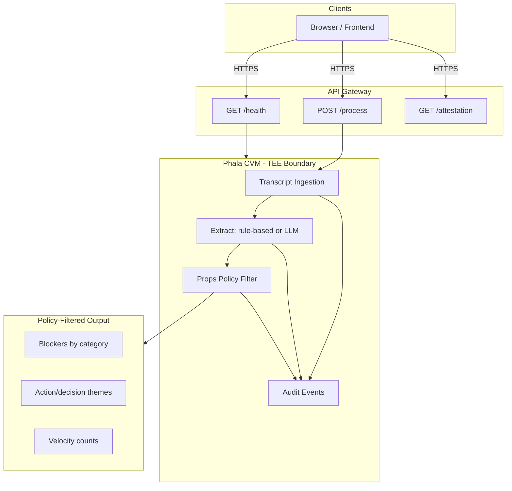

# Lucky Charm — Cloud Architecture

## Data Flow

## Components

| Component | Purpose |
|-----------|---------|
| **Frontend (Vercel)** | React app: login, upload, dashboard. Mock or Live TEE mode. |
| **Backend (Phala CVM)** | Flask app inside Confidential VM. Processes transcripts only in TEE. |
| **Props Filter** | Ensures only metrics, themes, velocity leave TEE. No verbatim quotes. |
| **U2SSO / sso-poc** | Optional: pseudonym-based auth. Submissions tied to opaque participant_id. |

## Threat Model

**We protect against:** Organizers, other teams, and the host seeing raw transcripts or linking contributions to real identities.

**We do not protect against:** Compromised TEE (side-channels, physical attacks), malicious participants submitting fake data, or compromise of the aggregation logic.

## Research Alignment

We align our design with three research threads. The table below maps each to what we implement and what we defer.

| Area | Paper | What we do | What we defer |
|------|-------|------------|---------------|
| **Props** | [2410.20522](https://arxiv.org/abs/2410.20522) — Props / contextual integrity | Keyword-only summaries, no verbatim quotes; strict category schema (integration, environment, resource, task, other); transcript hash verification; LLM output validation against allowlist | Full Props formal model; extended semantic classification |
| **ASC** | [2025-618](https://arxiv.org/abs/2025-618) — Unlinkable SSO (ASC) | Pseudonym mode: opaque `participant_id`; mock/session auth; **U2SSO**: nullifier per submission, duplicate rejection; sso-poc stub or real SSO | Full ASC: IdR on-chain, child credentials, ZK nullifier proofs |
| **TEE** | [2506.14964](https://arxiv.org/abs/2506.14964) — TEE Threat Model & Deployment | Transcript processing inside Phala CVM; attestation endpoint for client verification; Props filter within TEE boundary; audit events (ingestion, aggregation, policy output) | PPID binding to hosting provider; physical/side-channel threat mitigation; trustless CVM placement verification |

**For judges:** Our Props filter implements contextual-integrity ideas from the Props work: only metrics and themes leave the TEE. Pseudonym mode follows ASC goals (unlinkability) in a lightweight form; full U2SSO would add Sybil resistance. TEE security assumes Phala CVM isolation; [2506.14964](https://arxiv.org/abs/2506.14964) discusses gaps between TEE threat models and real deployment—we document those in our Limitations.

---

## Limitations

1. **TEE trust:** Security relies on Phala CVM isolation. A compromised CVM could leak data. See [2506.14964](https://arxiv.org/abs/2506.14964) on threat-model vs deployment gaps.
2. **Pseudonym binding:** Pseudonym mode uses session-based IDs. Cross-device linking is not addressed. Full U2SSO ([2025-618](https://arxiv.org/abs/2025-618)) would add Sybil resistance.
3. **Transcript integrity:** We verify transcript hash client→server when the client sends it. See PRIVACY_POLICY.md.
4. **Sybil resistance:** With U2SSO enabled, nullifiers prevent duplicate `(participant_id, nullifier)` submissions. Stub uses synthetic nullifiers; production sso-poc would use ZK proofs.

---

## U2SSO Flow

When `VITE_SSO_BASE_URL` is set (e.g. `/sso-api`), the frontend uses real SSO:

1. **Login:** `GET /api/challenge/login` → `POST /api/login` with `{ name, challenge, sname, spk, signature }`. SSO returns `session_token`, `user_id` (→ `participant_id`).
2. **Submission:** Before each transcript upload, `POST /api/submission/nullifier` with `{ participant_id }` → `{ nullifier }`.
3. **Process:** Frontend sends `participant_id` + `nullifier` to TEE `POST /process`.
4. **TEE:** If both present, rejects duplicate `(participant_id, nullifier)`; stores used nullifiers in memory.

**IdR / child credentials:** Identity Registry (blockchain) and per-SP child credentials are provided by sso-poc when deployed. See [2025-618](https://eprint.iacr.org/2025/618).

**Local dev:** Run `sso-poc-stub/sso_stub.py` on port 8081; set `VITE_SSO_BASE_URL=/sso-api` so Vite proxies to the stub.
